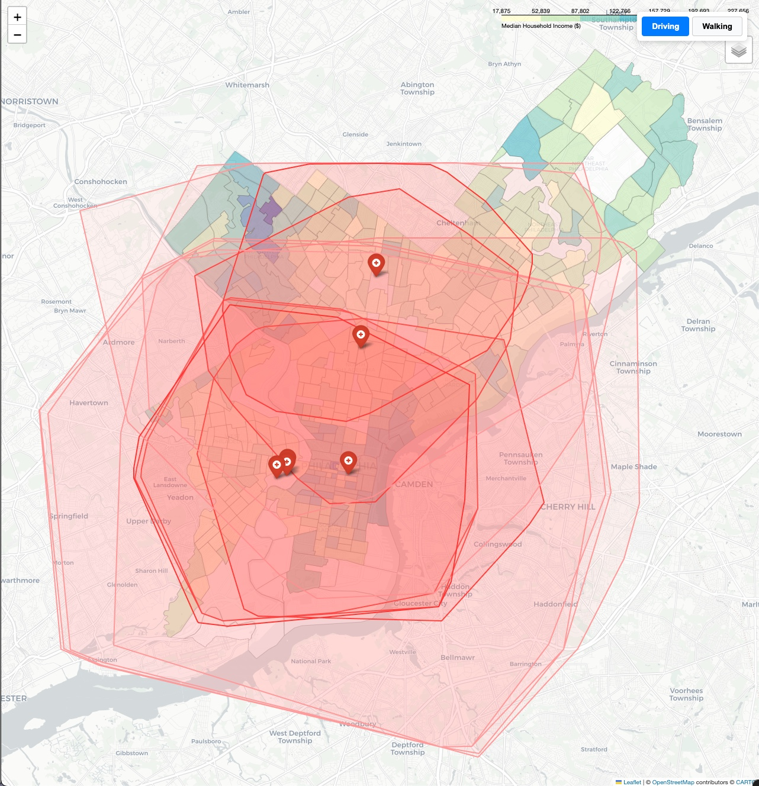
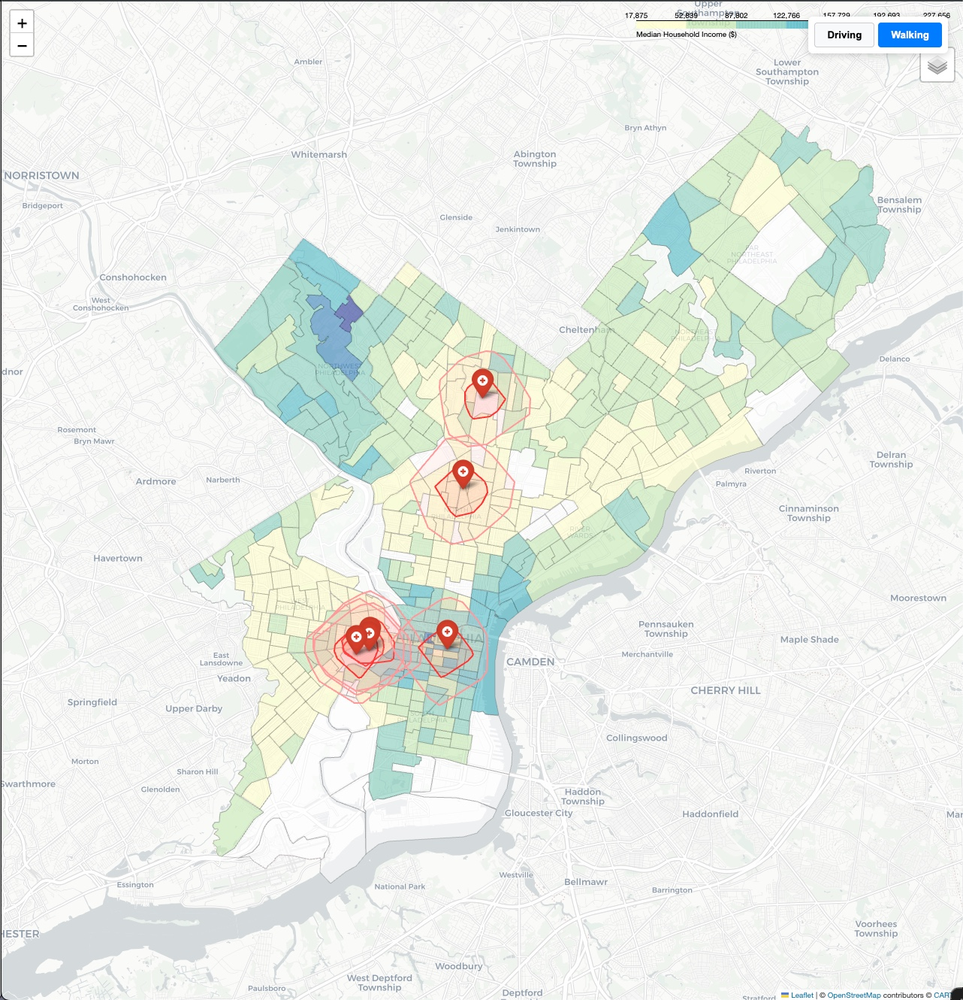

# Cancer Care Desert Atlas: Philadelphia

## Overview
This project maps spatial access to premier cancer care facilities in Philadelphia. By combining US Census demographic data with OpenStreetMap network algorithms, this tool computes both drive-time and walk-time isochrones to identify healthcare "access deserts." These are vulnerable, income-stratified neighborhoods that lack efficient transit access to advanced oncology care.

## Clinical Motivation
I built this tool to bridge the gap between oncogenomics and healthcare equity. While tumor biology dictates clinical treatment, spatial geography often dictates access. 

I've seen firsthand the clinical bottleneck: when a 15-minute walk to an outpatient clinic turns into an hour-long, multi-transfer transit ordeal, preventative screenings and consistent treatments drop off. Patients in these spatial "health deserts" often don't interact with the healthcare system until a late-stage crisis forces an emergency admission. This project visually isolates exactly who can realistically reach centers like CHOP, Penn Medicine, and Jefferson Health for continuous care.

## View the Interactive Map
[**Click here to view the live interactive web map**](https://ryan-tobin.github.io/cancer-care-desert-atlas/)  
*(Features a seamless UI toggle between driving and walking accessibility metrics).*

## Tech Stack & Packages
* **Python**: Core data processing and statistical analysis
* **GeoPandas & Shapely**: Spatial joins, coordinate reference system (CRS) alignment, and polygon manipulation
* **OSMnx & NetworkX**: Street network retrieval and non-Euclidean travel-time isochrone calculation (accounting for real-world transit barriers)
* **Folium & Leaflet**: Interactive web mapping and choropleth rendering
* **Census API**: Demographic and socio-economic data retrieval
* **HTML/CSS**: Frontend iframe wrapper for single-page application state management on GitHub Pages

## Methodology
1. **Demographic Mapping**: Pulled ACS 5-Year Estimates for Median Household Income via the Census API and joined them to Philadelphia TIGER/Line census tract shapefiles.
2. **Network Analysis**: Downloaded the drivable and walkable street networks around major Philadelphia oncology centers using OSMnx, ensuring accurate routing around urban barriers (e.g., rivers, highways).
3. **Isochrone Generation**: Calculated 15-minute and 30-minute travel bubbles using NetworkX ego graphs to model actual transit limits rather than simple "as the crow flies" distances.
4. **Spatial Overlay**: Combined the socio-economic choropleth map with the transit polygons to visually isolate low-income areas falling outside the accessibility zones.
5. **Deployment**: Exported the spatial layers to static HTML via Folium and wrapped them in a custom frontend UI hosted on GitHub Pages for seamless user interaction.

## Future Scope
* Integration of EPA Environmental Justice data (e.g., RSEI toxicity scores) to map environmental carcinogen exposure against these existing health deserts.